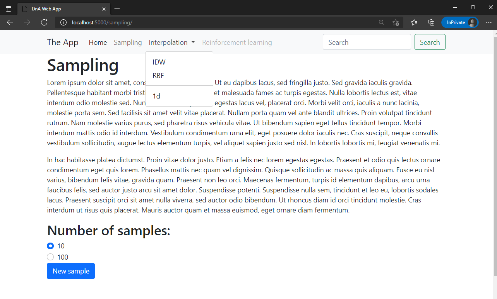

# Web app using [Flask](https://flask.palletsprojects.com/en/2.0.x/)

Example of multi-page web app based on well established web development techniques.

## Pros

* Easy to extend to multiple pages
* Understandable urls
* Link to sub-page works as expected

## Cons

* Interactivity is painful
* Requires some knowledge of Python, HTML, CSS & JavaScript :scream: